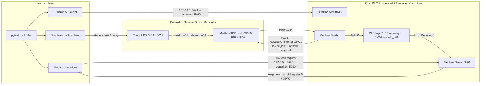

# OpenPLC Validation Lab

基于 Python 的 OpenPLC Modbus/TCP 系统可靠性与自动化验证项目。

## Current Status

已建立基于 OpenPLC Runtime、Modbus/TCP、Python 和 pytest 的系统验证基础链路。

目前已完成：

### Communication Baseline

- 基于 Docker 的 OpenPLC Runtime v4.2.2 测试环境
- PLC 编译、上传、运行与基础 smoke validation
- Modbus/TCP Server 配置、监听与寄存器映射验证
- Python + pymodbus 端到端读写验证
- OpenPLC Modbus Master Remote Device 正常通信链路验证

### Protocol Validation

- Modbus Holding Register mapped/unmapped 边界行为验证与自动化
- 未注册 device_id 的异常响应与后续连接可用性验证
- UINT 16-bit 数据边界与回绕行为验证

### Fault Injection and Recovery

- PLC Stop/Start 服务中断与自动恢复验证
- 连续两轮 Stop/Start recovery stability 验证
- 基于 Runtime HTTPS API + JWT 的 PLC 状态控制
- 适用测试场景中的 bounded polling 与状态恢复
- 可控 Python Modbus/TCP 远端设备模拟器
- 远端通信中断后的 `set-to-zero` 行为验证
- 远端服务恢复后的自动重连与数据恢复验证
- OpenPLC Runtime 容器重启后的 API、PLC、Modbus 和数据链路恢复验证
- 远端服务保持监听但响应延迟时的 terminal timeout、清零和恢复验证

### Historical Issue Reproduction

- 在隔离的 OpenPLC Runtime v4.1.9 环境中复现历史 stale-value 行为

### Regression Testing

- pytest 正常通信 baseline 自动化测试
- OpenPLC Runtime v4.1.9 与 v4.2.2 的端到端回归对照
- PLC 服务、Runtime 容器、远端连接和响应超时等不同故障路径的自动回归

当前自动化测试结果：`11 passed`

当前 Remote Device 回归已覆盖与 OpenPLC Issue #691 相关的历史 stale-value 行为和当前 fixed behavior。

## Documentation

- [Validation Scope](docs/validation_scope.md)
- [Validation Basis](docs/validation_basis.md)
- [Test Architecture](docs/test_architecture.md)
- [Test Matrix](docs/test_matrix.md)
- [Issue #691 Validation Report](docs/issue_691_validation.md)
- [Project Roadmap](docs/roadmap.md)

## Remote Device Validation Architecture

当前端到端测试拓扑：



模拟器控制接口为 `127.0.0.1:15021`，只绑定本机 loopback，支持：

- `status`
- `fault_on`
- `fault_off`
- `delay_on <milliseconds>`
- `delay_off`

`delay` 模式保持 Modbus 服务和 listener 可用，同时延迟目标 FC03 响应，用于验证响应超时路径；指定延迟值仅是测试故障注入参数，不代表通用协议阈值。

本项目当前验证使用的 Remote Device 配置为：

- Device：`sim_remote_device`
- Host：`host.docker.internal`
- Port：`15020`
- Slave ID：`1`
- Function：FC03 Read Holding Registers
- Offset / Length：`0 / 1`
- Cycle：`100 ms`
- IEC mapping：`%IW0`
- Error handling：Set to zero
- Normal remote value：`1234`

以上参数属于本项目的测试 fixture 配置，不代表 OpenPLC 的通用默认值。

## Modbus Master Remote Disconnect Regression

正式回归测试位于 `tests/test_modbus_master_fault_recovery.py`，测试名为 `test_remote_disconnect_zero_fills_and_recovers`。它验证：

1. Normal：远端 HR0 和 `%IW0` 均为 `1234`。
2. Fault：`fault_on` 使远端 Modbus 通信不可用，映射的 `%IW0` 被清零。
3. Recovery：`fault_off` 恢复远端服务，OpenPLC 自动重连，`%IW0` 恢复为 `1234`。
4. Cleanup：无论测试结果如何，均尽力恢复模拟器和映射值的正常状态。

这是针对 OpenPLC Runtime v4.2.2、Editor 生成的 Remote Device 配置和 controlled pymodbus simulator 的端到端 fixed-behavior regression。它覆盖与 OpenPLC Issue #691 相关的修复后行为；历史复现结果见下节，两组结论均只适用于实际验证的版本和配置。

## Additional Recovery Validation

- `tests/test_runtime_restart_recovery.py` 验证当前持久化 fixture 在 `docker restart openplc-runtime` 后出现真实中断，并恢复 Runtime API、PLC、Modbus Master/Slave 和稳定的 `%IW0=1234` 数据链路。该结果不等同于 crash 或主机掉电恢复，也不构成恢复时间保证。
- `tests/test_modbus_master_timeout_recovery.py` 使用受控延迟使当前 Remote Device 请求耗尽重试并进入 terminal timeout 路径，验证 `%IW0` 稳定清零及解除延迟后的 `1234` 恢复。该结果仅适用于已验证版本和当前配置。

## Historical Issue #691 Regression Validation

历史复现使用隔离的 OpenPLC Runtime v4.1.9 容器、独立持久卷和独立 loopback endpoint，避免影响当前 v4.2.2 基线。

在 v4.1.9 的端到端实验中，正常通信时远端 HR0 和 `%IW0` 均为 `1234`。受控断开后，真实 FC03 请求不可用，Runtime 的 `MODBUS_MASTER` 记录连接失败；故障窗口内 20/20 次 FC04 观测仍为 `1234`，复现了历史 stale-value 行为。恢复远端服务后，通信和值均恢复正常。

| Runtime | Normal | Remote disconnect | Recovery | Result |
|---------|--------|-------------------|----------|--------|
| v4.1.9 | `1234` | stays `1234` | `1234` | historical stale-value behavior reproduced |
| v4.2.2 | `1234` | zero-filled to `0` | returns to `1234` | fixed behavior regression passes |

源码与发布历史给出的修复边界为 Editor v4.2.10 → v4.2.11、Runtime v4.1.9 → v4.1.10：Editor 侧生成 `error_handling` 配置，Runtime 侧在远端读取失败时执行 zero-fill。该边界仅作为 source-history context；本项目实际完成端到端验证的 Runtime 版本是 v4.1.9 和 v4.2.2，不据此推断其他版本或配置具有相同行为。

同一个远端设备故障场景现在能够区分历史 stale-value 行为与当前 fixed behavior，形成从缺陷复现到回归验证的闭环。

## Prerequisites

- Python 3.11
- Docker environment
- OpenPLC Runtime v4.2.2，作为当前 regression baseline
- `requirements.txt` 中记录的 pytest 及项目依赖

部分 PLC Stop/Start recovery tests 需要通过环境变量提供 Runtime API credentials：

- `OPENPLC_USERNAME`
- `OPENPLC_PASSWORD`

仓库不保存凭据的实际值。

## Running the Validation

运行验证前应确认：

- OpenPLC Runtime 正在运行；
- PLC fixture 已加载并处于可运行状态；
- Remote Device configuration 已存在。

启动 controlled simulator：

```powershell
python src/modbus_sim_server.py
```

该进程提供：

- Modbus/TCP：`0.0.0.0:15020`
- 本地控制接口：`127.0.0.1:15021`
- 固定测试值：`HR0=1234`

完整测试套件依赖 OpenPLC Runtime、当前 PLC/Remote Device fixture、controlled simulator 和 Docker 环境均已就绪。被测试显式判定为 fixture unavailable 的 simulator control 或 Docker 前置条件可能导致对应测试 skip；SUT 已就绪后的行为异常仍会 FAIL。两条 PLC Stop/Start recovery tests 还需要通过环境变量提供 `OPENPLC_USERNAME` 和 `OPENPLC_PASSWORD`，仓库不保存实际凭据。缺少这两个变量会使对应测试 skip，而不是产品行为 FAIL。

运行全部测试：

```powershell
pytest -q
```

在上述外部 fixture 和 Runtime API credentials 均可用时，已验证结果：`11 passed`

`src/modbus_fault_characterization.py` 用于手工观察 `normal → disconnect → zero-fill → recovery` 的时间过程。它是诊断和时间观测工具，不是性能 benchmark，其单次测量结果不构成恢复时间保证。

## Validation Roadmap

- 扩展具有明确验证价值的网络故障场景
- 完善额外的恢复与可观测性覆盖
- 持续完善日志、报告和测试证据管理
