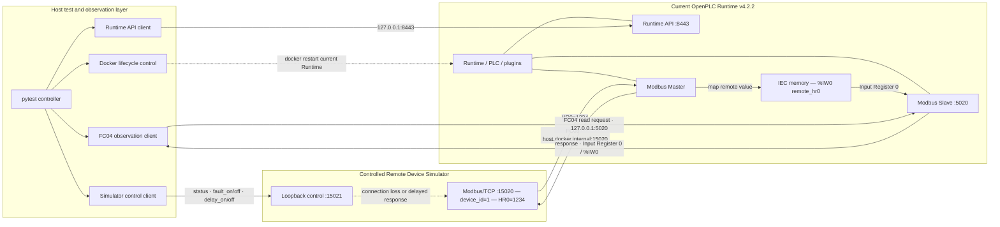

# OpenPLC Modbus/TCP 系统测试架构

## 文档信息

- 初始设计阶段：M0.4
- 当前状态：Implemented validation architecture
- 用途：描述当前 OpenPLC Modbus/TCP validation system architecture
- 范围：系统测试组件、数据流、故障注入、观测方式和实施状态

本文档保留 M0.4 阶段确定的“设备模拟器 + OpenPLC + 测试控制器”架构思路，并同步当前 v1.1 已实现状态。详细测试结果与证据边界见 `validation_basis.md` 和 `issue_691_validation.md`。

## 一、架构目标

本项目采用“Python Modbus Device Simulator + OpenPLC + Python Test Controller”的测试架构，目标是围绕 OpenPLC 与远程 Modbus/TCP 设备之间的通信行为建立可控制、可重复、可观察的系统验证环境。

OpenPLC Editor Issue #691 描述的场景是：OpenPLC 配置远程 Modbus/TCP device 并正常通信后，远程连接丢失时，配置为 reset-to-zero 的值仍被保留。因此，忠实复现该问题需要让 OpenPLC 主动连接一个可控的远程设备，而不是只让 Python 作为普通 Modbus Client 读取 OpenPLC。

设备模拟器用于控制远程数据和连接生命周期；OpenPLC 作为被测系统执行实际的远程设备通信与状态处理；测试控制器负责安排步骤、制造故障、收集观测结果并执行断言。通过分离这些职责，可以主动构造并重复执行以下状态：

1. 正常通信：设备在线并提供确定的寄存器值。
2. 连接丢失：测试主动停止设备，使 OpenPLC 的远程连接中断。
3. 响应延迟：设备 listener 保持可用，但目标 FC03 响应被受控延迟。
4. 通信恢复：取消连接或延迟故障，观察 OpenPLC 是否重连以及数据是否恢复。

当前系统已经包含：

- Python Modbus Device Simulator；
- OpenPLC Runtime as System Under Test（SUT）；
- Python Test Controller with pytest；
- Observation / Evidence Layer。

当前架构实际支持：

- normal communication validation；
- connection loss fault injection；
- terminal delayed-response timeout fault injection；
- Runtime container restart recovery；
- recovery validation；
- historical Issue #691 reproduction；
- fixed behavior regression validation。

当前逻辑架构如下：



当前主要数据观测接口已经确定为 OpenPLC Modbus Slave FC04 对 `%IW0` 的读取。Runtime API 用于 PLC 状态控制与确认，Runtime 日志用于通信失败证据采集，pytest 输出用于自动化判定。

## 二、组件

### 2.1 Python Modbus Device Simulator

#### 负责

- 模拟 OpenPLC 所连接的远程 Modbus/TCP 设备。
- 提供确定、可配置的寄存器数据，为测试建立稳定输入。
- 支持受控启动、停止和恢复，用于制造 connection loss。
- 支持 normal、fault 和 delayed 模式，以区分连接丢失与响应超时路径。
- 通过 `status`、`fault_on`、`fault_off`、`delay_on <ms>` 和 `delay_off` 提供有界、可确认的控制接口。
- 记录启动、连接、请求、响应和停止等关键事件及时间。
- 当前为 Remote Device 场景提供确定的 Holding Register 数据，其他数据区域按未来测试需求扩展。

#### 不负责

- 不实现或替代 OpenPLC 的内部逻辑。
- 不负责决定测试通过或失败。
- 不模拟完整工业设备、全部 Modbus 功能或真实硬件时序。
- 不把模拟器自身的状态直接当作 OpenPLC 已经接收或处理数据的证据。

### 2.2 OpenPLC System Under Test

#### 负责

- 作为 System Under Test（SUT）运行待验证的 OpenPLC 版本。
- 配置并连接远程 Modbus/TCP device。
- 从 Python 模拟设备读取数据，并按照 OpenPLC 的配置处理数据状态。
- 应用 Remote Device 的 `set-to-zero` error handling 配置。
- 通过 Modbus Slave FC04、Runtime API 和 Runtime 日志提供可重复的状态观测与证据。

#### 不负责

- 不负责生成测试输入或安排测试步骤。
- 不负责主动制造远程设备故障。
- 不把 Release Notes 中的修复声明视为自身已经通过验证。
- 不以复杂 PLC 控制逻辑作为本架构的测试重点；必要逻辑只作为可观察数据路径的测试夹具。

### 2.3 Python Test Controller

#### 负责

- 使用 pytest 组织测试准备、执行、清理和断言。
- 设置模拟设备的初始数据和测试数据。
- 检查各组件是否达到测试前置状态。
- 按测试步骤启动、停止和恢复模拟设备，主动制造连接中断。
- 控制 simulator 的响应延迟，并编排当前 Runtime 容器 restart 场景。
- 记录操作时间点，协调等待、轮询和超时判定。
- 从 Observation / Evidence Layer 采集 OpenPLC 的实际结果。
- 将预期行为与实际结果比较，生成明确的通过、失败或不可判定结果。

#### 不负责

- 不替代 OpenPLC 执行被测状态处理。
- 不使用未经验证的内部变量或临时接口作为正式断言依据。
- 不根据模拟器状态推断 OpenPLC 状态，而不获取独立观测证据。
- 不在测试未成功复现时声称某个 OpenPLC 版本存在 Issue #691 所述行为。

### 2.4 Observation / Evidence Layer

#### 负责

- 为测试控制器提供 OpenPLC 实际状态的可重复观测路径。
- 采集与测试步骤对应的值、连接状态、错误信息、日志和时间信息。
- 保留足以复核测试结论的原始证据和结构化结果。
- 区分模拟器日志、测试控制器日志与 OpenPLC 日志，形成可关联的时间线。

#### 不负责

- 不依赖未经验证的 OpenPLC 调试接口。
- 不通过一次性人工界面观察代替可重复证据。
- 不改变被测行为以便获得期望结果。
- 不在证据不足时输出确定性的通过或失败结论。

当前正式数据观测路径为 OpenPLC Modbus Slave FC04 对 `%IW0` 的读取；Runtime API、Runtime 日志和 pytest 输出作为状态控制与辅助证据。

## 三、当前正常通信数据流

Remote Device 正常通信链路为：

```text
Python Modbus Device Simulator 提供 HR0=1234
    → OpenPLC Modbus Master 使用 FC03 读取 remote address 0
    → Remote Device mapping 将值写入 IEC %IW0
    → OpenPLC Modbus Slave 使用 FC04 暴露 Input Register 0
    → Python Test Controller 读取并验证 %IW0=1234
```

正常场景首先用于建立通信基线。只有能够证明 OpenPLC 已经通过目标数据路径读取到模拟设备提供的非零值，后续断线后的状态变化才具有可判定性。

正常场景至少需要保留以下信息：

- OpenPLC Runtime、pymodbus 和测试依赖版本。
- Remote Device 通信参数与 IEC mapping。
- simulator 的确定输入值。
- FC03 remote readiness 结果。
- FC04 IEC observation 结果。
- pytest 判定或 characterization 输出。

## 四、当前故障注入与恢复数据流

### 4.1 连接丢失与恢复

连接中断与恢复场景的数据流为：

```text
Simulator 与 OpenPLC 正常通信
    → 测试控制器确认 remote HR0 和 %IW0 均为 1234
    → fault_on 停止 simulator 的 Modbus 服务
    → 真实 FC03 请求确认远端服务不可用
    → Runtime MODBUS_MASTER 记录读取或连接失败
    → 测试控制器通过 FC04 持续观察 %IW0
    → fault_off 恢复 simulator，HR0 重建为 1234
    → OpenPLC Modbus Master 重新建立通信
    → FC04 观察 %IW0 恢复并保持 1234
```

故障注入采用明确 timeout 和 bounded polling，不使用无限等待。测试清理逻辑会尽最大努力恢复 simulator normal 状态和 OpenPLC 数据链路。单次故障识别或恢复时间只作为运行证据，不构成性能保证。

### 4.2 终止性响应超时与恢复

当前已验证的 delayed-response 数据流为：

```text
OpenPLC Modbus Master 发送 FC03
    → simulator 保持 listener 可用并受控延迟目标响应
    → 当前 timeout/retry 预算耗尽并进入终止性失败路径
    → set-to-zero 将 %IW0 更新为 0
    → delay_off 取消响应延迟
    → remote HR0 和 %IW0 稳定恢复为 1234
```

当前验证使用 `delay_on 5000` 作为明确故障注入值；该值不是 Modbus 协议或 OpenPLC 的通用 timeout 阈值，也不用于断言精确清零或恢复时间。

### 4.3 Runtime 容器重启与恢复

当前 Runtime lifecycle 数据流为：

```text
确认 current v4.2.2 持久化 fixture、API 和 %IW0=1234 正常
    → docker restart openplc-runtime
    → 观察到 Runtime API、container state 或 FC04 的真实中断
    → Runtime API、PLC、plugins 和 Modbus 通信恢复
    → FC04 连续观察 %IW0 稳定为 1234
```

该场景验证当前持久化 fixture 的容器 restart recovery，不等同于进程 crash、主机掉电或其他 OpenPLC 版本，也不提供恢复延迟保证。

## 五、Issue #691 验证状态

- Issue #691 是 OpenPLC Editor 仓库中的公开缺陷报告，描述连接丢失后 reset-to-zero 未按预期生效、旧值仍被保留的现象。
- OpenPLC Editor v4.2.11 Release Notes 将相关问题列为修复项；该记录是官方修复声明，不是本项目测试结果。
- 在 OpenPLC Runtime v4.1.9 和当前测试配置下，远端通信确实失败且 Runtime 记录连接错误时，20/20 次 `%IW0` 观测仍保持 `1234`，historical stale-value behavior 已复现。
- 在 OpenPLC Runtime v4.2.2 和当前测试配置下，正式回归验证了 `1234 → connection loss → 0 → recovery → 1234` 的 fixed behavior。
- 上述结论仅适用于实际验证的版本和配置，不代表所有旧版本或所有新版本具有相同行为。

完整环境、配置、证据和结论边界见 `issue_691_validation.md`。

## 六、分阶段实施策略与状态

### Stage 1：OpenPLC 基础环境和正常通信

状态：已完成。

- 建立并记录 OpenPLC Runtime v4.2.2 当前验证环境。
- 完成 PLC 编译、上传、运行和基础 smoke validation。
- 配置 Modbus/TCP Server 和 Remote Device。
- 建立可重复的正常通信基线并确认数据路径。

### Stage 2：Python 自动化 Modbus 基线测试

状态：已完成。

- 建立 Python 侧 Modbus/TCP 连接、请求和响应验证能力。
- 使用 pytest 固化正常连接、合法请求、超时和清理流程。
- 完成地址边界、unknown device ID 和 UINT 边界验证。
- 明确连接参数、测试数据和失败信息格式。

### Stage 3：Python Modbus Device Simulator

状态：已完成。

- 实现满足目标数据路径所需的最小 Modbus/TCP 设备行为。
- 提供确定寄存器数据以及 normal、fault、delayed 和 recovery 控制。
- 使用独立 loopback control channel 同步 simulator 状态。
- 验证 Docker Runtime 到 Windows host simulator 的通信链路。

### Stage 4：连接中断和恢复故障注入

状态：已完成。

- 由测试控制器编排正常、故障、观测和恢复步骤。
- 使用真实 FC03 验证远端通信中断。
- 使用 FC04 持续观察 OpenPLC IEC 数据状态。
- 验证 terminal delayed-response timeout 后的清零与恢复。
- 验证当前 Runtime 容器 restart 后的 API、PLC、插件、Modbus 和数据链路恢复。
- 使用 bounded polling、timeout 和 cleanup 保证测试可控。

### Stage 5：Issue #691 复现与 Regression Test

状态：已完成。

- 在隔离的 Runtime v4.1.9 环境中复现 historical stale-value behavior。
- 在 Runtime v4.2.2 环境中验证 fixed behavior。
- 区分公开 Issue、官方修复声明和本项目测试结果。
- 形成历史行为与当前行为的端到端回归对照。

### Stage 6：日志、报告和自动回归完善

状态：持续维护。

- 维护 simulator、控制器与 OpenPLC 日志的证据关联。
- 完善结构化报告、失败证据和重复执行流程。
- 扩展必要的 observability 和回归覆盖。
- 评估 CI integration 的适用范围和环境要求。

## 七、已确认项与后续事项

### 已确认

- Remote Device 配置和 `set-to-zero` error handling；
- `%IW0` 作为 Remote Device IEC observation variable；
- FC03 remote read 与 FC04 observation data path；
- Python Modbus Device Simulator 的受控 normal/fault/delayed/recovery 接口；
- 当前 Runtime 容器 restart recovery 路径；
- OpenPLC Runtime v4.1.9 historical candidate 验证环境；
- OpenPLC Runtime v4.2.2 current regression baseline；
- Runtime API、Runtime 日志和 Modbus observation 的证据用途。

### 后续事项

- 扩展更多 Modbus 协议覆盖；
- 增加具有明确验证价值的 fault scenarios；
- 持续完善日志、报告和观测能力；
- 评估并设计适合外部 Runtime 依赖的 CI integration。
